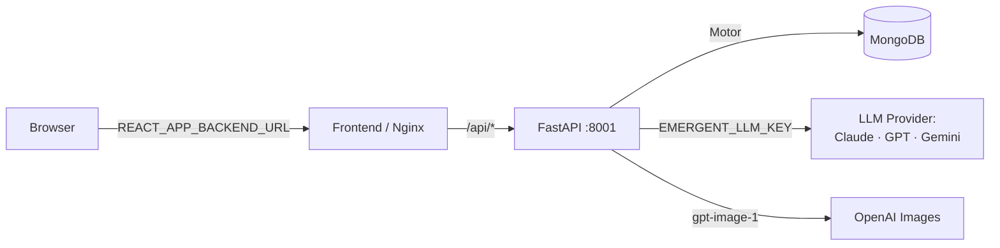

# OmniverseOS

A futuristic, cyberpunk AI operating system in the browser. 18 modular apps —
AI chat, image generation, voice, notes, tasks, calendar, finance, code editor,
analytics, and more — running inside a draggable-window OS shell.

## Stack

- **Backend**: FastAPI · MongoDB (Motor) · JWT auth · Emergent LLM integration
- **Frontend**: React 19 · Tailwind · Framer Motion · Recharts · Lazy-loaded modules

## Architecture



```
backend/
  server.py            FastAPI app, all routes, lifespan, rate limit, indexes
  Dockerfile
frontend/src/
  App.js               Shell entrypoint
  context/OSContext    Auth + window manager + notifications
  components/
    Desktop / Window / Dock / TopBar
    CommandPalette / NotificationCenter / AuthScreen / ErrorBoundary
  apps/                18 lazy-loaded modules (one file each)
  lib/api.js           Axios + SSE streaming client
  lib/apps.js          Lazy app registry
```

## API

All routes prefixed `/api`. Auth required except `/`, `/health`, `/auth/*`.

| Method | Path | Notes |
|---|---|---|
| GET | `/api/health` | DB ping |
| POST | `/api/auth/signup` | `{email,password,name}` → `{token,user}` |
| POST | `/api/auth/login` | `{email,password}` → `{token,user}` |
| GET | `/api/auth/me` | Current user |
| POST | `/api/ai/chat/stream` | SSE stream. Rate-limited 30/min/user |
| POST | `/api/ai/chat` | Non-stream. Rate-limited 30/min/user |
| GET | `/api/ai/chat/history/{sid}` | Messages for a session |
| POST | `/api/ai/image` | gpt-image-1 → base64. Rate-limited 8/min/user |
| GET | `/api/ai/image/history` | Past generations |
| GET/POST/PUT/DELETE | `/api/notes`, `/api/tasks` | Full CRUD |
| GET/POST/DELETE | `/api/events`, `/api/transactions`, `/api/memories`, `/api/files` | Create/list/delete |
| GET | `/api/analytics/summary` | Aggregated counts + finance net |

List endpoints accept `?limit=N&skip=M` (limit ≤500, default 200).

Models whitelisted in `ALLOWED_MODELS`: Claude Sonnet 4.6/4.5, Haiku 4.5,
GPT-5.4 / 5.4-mini / 5.2, Gemini 3 Flash / 3.1 Pro / 3.5 Flash.

## Database

Single-tenant per user (every doc scoped by `user_id`). Collections:
`users` (unique idx on `email`), `notes`, `tasks`, `events`, `transactions`,
`memories`, `files`, `images`, `chat_messages`. Compound indexes
`(user_id, created_at desc)` on the six per-user collections;
`(user_id, session_id, created_at)` on `chat_messages`. Indexes auto-created
on FastAPI startup.

## Environment

Backend (`backend/.env`, see `.env.example`):

| Var | Required | Purpose |
|---|---|---|
| `MONGO_URL` | yes | Mongo connection string |
| `DB_NAME` | yes | Database name |
| `CORS_ORIGINS` | yes | Comma-list or `*` |
| `JWT_SECRET` | yes in prod | HS256 signing key |
| `EMERGENT_LLM_KEY` | yes for AI | LLM gateway key |

Frontend (`frontend/.env`):

| Var | Required | Purpose |
|---|---|---|
| `REACT_APP_BACKEND_URL` | yes | Public backend URL |
| `WDS_SOCKET_PORT` | dev | Dev-server HMR socket |

## Deploy

### Docker Compose

```bash
cp backend/.env.example backend/.env   # fill JWT_SECRET, EMERGENT_LLM_KEY
export JWT_SECRET="$(openssl rand -hex 32)"
export EMERGENT_LLM_KEY="sk-emergent-..."
docker compose up -d
```

Frontend on `:3000`, backend on `:8001`, mongo internal.

### Manual

```bash
# backend
pip install -r backend/requirements.txt --extra-index-url https://d33sy5i8bnduwe.cloudfront.net/simple/
cd backend && uvicorn server:app --host 0.0.0.0 --port 8001

# frontend
cd frontend && yarn install && yarn start
```

## Security Notes

- Auth uses bearer JWT only (no cookies) → CSRF not applicable.
- All LLM endpoints have per-user in-process rate limits + model whitelist
  + input length caps.
- Mongo queries use parameterised dict filters (no `$where` / `eval`).
- Browser module renders only a curated bookmark list — arbitrary URLs are
  **never** iframed (SSRF / clickjacking avoidance).
- Code Editor uses `new Function()` (not `eval`); confined to user's own tab.

## Tests

```bash
cd /app && python -m pytest backend/tests/ -v
```

Backend: 13 cases covering auth, CRUD, AI chat (real), AI image (real),
analytics. Frontend test infrastructure not yet wired up (see TODO).

## TODO (deferred)

- Frontend test suite (Jest + RTL) → target 90% coverage
- Full TypeScript migration
- `lifespan` context manager (replace deprecated `@app.on_event`)
- Split `server.py` into `routers/` packages
- GitHub Actions CI/CD workflow
